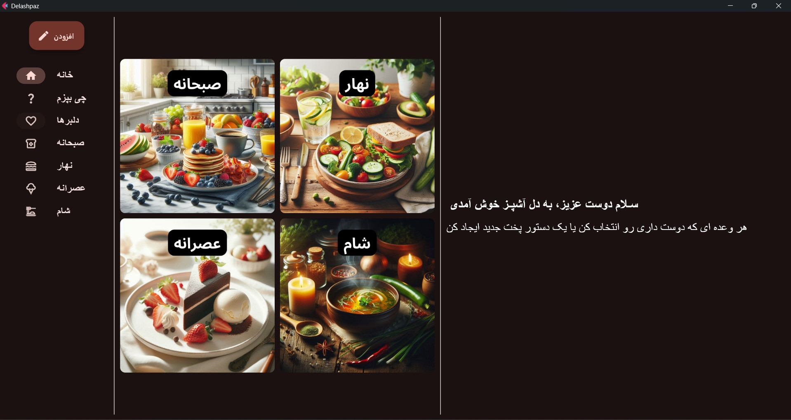
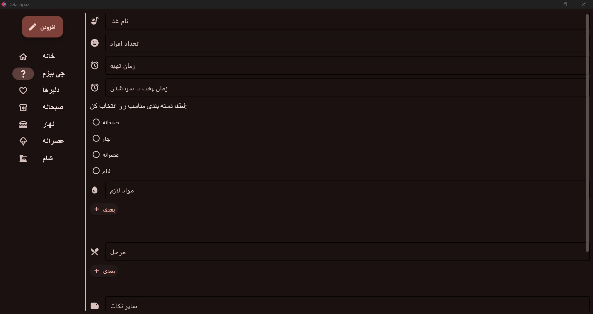
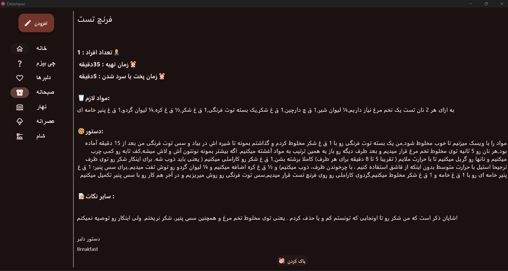
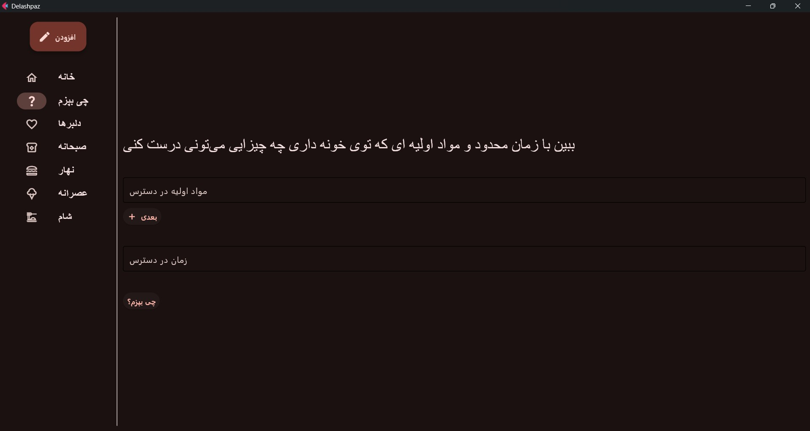
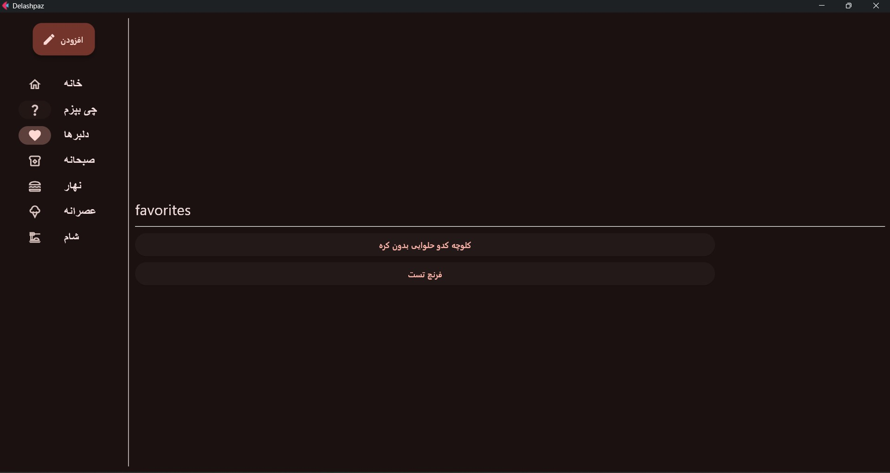

# 🍳 Delashpaz

Delashpaz is a desktop recipe management application built with Python and Flet.

The application allows users to create, organize, search, and manage cooking recipes in a simple and visually appealing interface.

---

## ✨ Features

### 📖 Recipe Management

* Add new recipes
* Store recipes in a local SQLite database
* View complete recipe details
* Delete recipes

### 🍽️ Meal Categories

Recipes can be organized into:

* 🥞 Breakfast
* 🍛 Lunch
* 🍰 Dessert
* 🍲 Dinner

### ❤️ Favorite Recipes

Mark recipes as "Delbar" recipes and access them from a dedicated favorites section.

### 🔍 Smart Recipe Finder

Enter:

* Available ingredients
* Available cooking time

Delashpaz will suggest recipes that match your ingredients and can be prepared within your time limit.

### 🖼️ Visual Interface

* Modern desktop UI built with Flet
* Food category images
* Navigation rail for easy access

---

## 🛠️ Technologies Used

* Python
* Flet
* SQLite3
* Threading

---

## 📂 Project Structure

```text
Delashpaz/
│
├── Images/
│   ├── Breakfast.png
│   ├── Lunch.png
│   ├── Dessert.png
│   ├── Dinner.png
│   └── Del.png
│
├── delashpaz.py
├── delashpaz.db
├── requirements.txt
└── README.md
```

---

## 🚀 Installation

Clone the repository:

```bash
git clone git@github.com:melofy-vibes/delashpaz.git
```

Move into the project directory:

```bash
cd delashpaz
```

Install dependencies:

```bash
pip install -r requirements.txt
```

Run the application:

```bash
python delashpaz.py
```

---

## 📸 Screenshots

### 🏠 Home Screen



### ➕ Add Recipe



### 📖 Recipe Details



### 🔍 Smart Recipe Finder



### ❤️ Favorite Recipes



## 💡 Future Improvements

* Edit existing recipes
* Export recipes
* Recipe ratings
* Nutritional information
* Dark/Light theme toggle
* Advanced search filters

---

## 👤 Author

Mehraveh Goharshadi

Python Developer & Machine Learning Enthusiast
